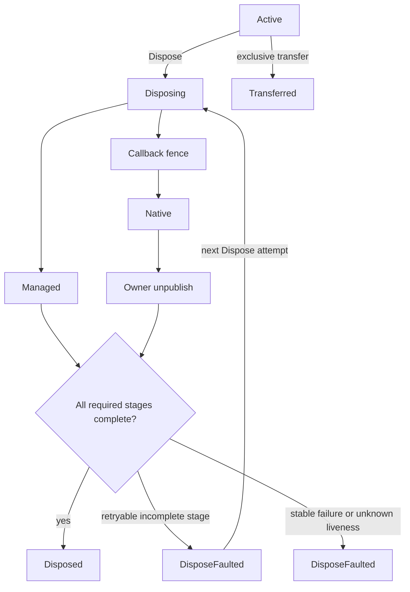

# ParaParty Util UnityNative

## Native wrapper lifecycle

The public lifecycle is intentionally small:



`Managed`, `CallbackFence`, `Native`, and `OwnerUnpublish` are independent completion bits, not additional lifecycle states. A wrapper never returns to `Active`. A cleanup retry only runs incomplete stages whose result explicitly proves that retrying is safe. Native pointer values, including zero, are never evidence that a resource is live or freed.

`NativeOwnershipKind.Owned` runs the native destroy hook. `NativeOwnershipKind.Borrowed` skips only native destruction; it still closes operation admission, drains operations, performs the other cleanup stages, invalidates the wrapper, and reaches `Disposed`.

## Native operations

The native pointer is private. Hold a `NativeOperationLease` across the complete P/Invoke interval:

```csharp
using (NativeOperationLease operation = wrapper.EnterOperation())
{
    NativeApi.DoWork(operation.Pointer);
}
```

Disposal closes admission before waiting for every active lease. A lease is a reference token identified by a monotonic owner ID, lifecycle epoch, and lease token. Disposing the same token more than once is a no-op, and a stale token cannot release a newer operation.

Use `NativeOperationGroup.Acquire(...)` for operations involving several wrappers. It deduplicates owners and acquires them by monotonic owner ID to avoid ABBA ordering. Wrappers that require thread affinity can select `NativeAccessPolicy.CreatingThreadConfined`.

## Exclusive transfer

Transfer is disabled by default. A wrapper must explicitly opt in and prove that it has no cleanup work which must remain with the wrapper. `CreateTransferTicket()` closes operation admission, requires zero active leases, runs the transfer preparation fence, moves the pointer, and makes the wrapper terminal as `Transferred`.

A `NativeTransferTicket` owns the pointer while pending. `TryCommit`, `TryRollback`, and `TryComplete(ticketId)` arbitrate ownership exactly once. A wrong or stale ticket ID cannot complete a newer transfer. Rollback retries are allowed only when the native cleanup result explicitly reports known-live retryability; unknown liveness is a stable fault.

## Finalization and tracking

Finalizers run only stages listed by the wrapper's `FinalizerSafeStages`, and only when their dependencies are complete. Finalizer cleanup and diagnostic sinks are fully contained: neither may throw from the finalizer thread. An incomplete finalizer never reports `Disposed`; `NativeCleanupDiagnostic` preserves the actual lifecycle, completed bits, ownership, and native liveness.

`ResourcesTracker` retains owners strongly and disposes every tracked owner in registration order. It aggregates failures after cleanup-all, removes terminal owners, and retains faulted owners for an explicit retry. Tracking is closed before cleanup begins.

## Migration

This lifecycle is a deliberate source break. Consumers must migrate before adopting a package that contains it.

| Previous API | Replacement |
| --- | --- |
| `IsEnabledDispose = true/false` | Constructor-only `NativeOwnershipKind.Owned` or `Borrowed` |
| `DisposableNativeObject(..., bool isEnabledDispose)` | Immutable ownership constructor |
| `NativePtr`, protected `ptr`, `INativePtrHolder` | `EnterOperation()` and `NativeOperationLease.Pointer` |
| Override `DisposeManaged()` | Return `CleanupStageResult` from `CleanupManagedResources()` |
| Override `DisposeUnmanaged()` | Return an explicit `NativeCleanupResult` from `CleanupNativeResource(IntPtr)` |
| Read/check pointer before a P/Invoke | Keep one lease alive across the entire P/Invoke |
| Hand a pointer to another native owner | Explicit opt-in plus `NativeTransferTicket` |

Old consumers and the new base are not compatible. There is no obsolete raw-pointer getter or mutable ownership shim because either would let unsafe consumers continue to compile.
