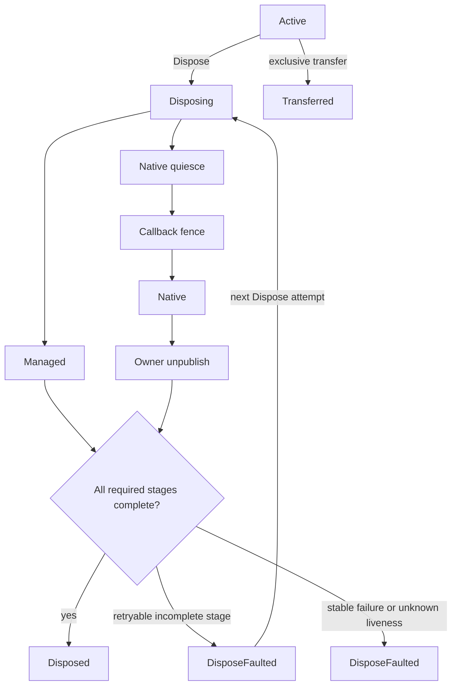

# ParaParty Util UnityNative

## Native wrapper lifecycle

The public lifecycle is intentionally small:



`Managed`, `NativeQuiesce`, `CallbackFence`, `Native`, and `OwnerUnpublish` are independent completion bits, not additional lifecycle states. A wrapper never returns to `Active`. A cleanup retry only runs incomplete stages whose result explicitly proves that retrying is safe. Native pointer values, including zero, are never evidence that a resource is live or freed.

Native quiescence cancels native work before callback draining and destruction. Each attempt receives a fresh `NativeQuiesceToken`; the protected `GetNativePointer(token)` resolver accepts it only during that hook invocation and rejects stale lifecycle, publication, owner, or attempt identities. The token is revoked before callback fencing and native destruction. A derived hook must apply its owning layer's absolute deadline to the complete cancellation operation and return success only after cancellation has completed. A timeout is an observable failure and may be retryable only when another attempt is proven safe; ParaPartyUtil does not provide a wall-clock timeout or an automatic retry loop.

`NativeOwnershipKind.Owned` runs the native destroy hook. Base-owned pinned handles and unmanaged buffers are released only after the cleanup oracle proves the owned native resource was freed; known-live and unknown failures retain that supporting memory. `NativeOwnershipKind.Borrowed` skips only native destruction; after its callback fence succeeds, it releases wrapper-owned supporting memory, performs the other cleanup stages, invalidates the wrapper, and reaches `Disposed`.

## Native operations

The native pointer is private. Hold a `NativeOperationLease` across the complete P/Invoke interval:

```csharp
using (NativeOperationLease operation = wrapper.EnterOperation())
{
    NativeApi.DoWork(operation.Pointer);
}
```

External disposal closes admission before waiting for every active lease. Disposal from the same logical execution context as one of the wrapper's active leases is rejected before lifecycle arbitration; release the outermost lease before disposing the wrapper. Pointer access attaches a transferred lease to its current execution context. A lease is a reference token identified by a monotonic owner ID, lifecycle epoch, and lease token. Disposing the same token more than once is a no-op, and a stale token cannot release a newer operation.

Use `NativeOperationGroup.Acquire(...)` for operations involving several wrappers. It deduplicates owners and acquires them by monotonic owner ID to avoid ABBA ordering. Wrappers that require thread affinity can select `NativeAccessPolicy.CreatingThreadConfined`.

Native callbacks may arrive on a thread without managed `ExecutionContext` flow and without the operation lease held by the native caller. A derived wrapper must enter its protected `EnterNativeCallbackExecution()` scope before an adapter invokes callback consumer code. Disposal from that scope fails before lifecycle arbitration, so a callback cannot wait for the native caller's lease while the caller waits for the callback to return. The opaque scope grants no pointer access and does not replace callback admission, native deregistration, exception containment, or the callback-drain fence required before native destruction.

## Exclusive transfer

Transfer is disabled by default. A wrapper must explicitly opt in, prove that it has no cleanup work which must remain with the wrapper, and override `IsTransferRollbackFinalizerSafe` only when rollback is valid on the finalizer thread. `CreateTransferTicket()` closes operation admission, requires zero active leases, runs the transfer preparation fence, constructs an unarmed ticket, then moves the pointer and makes the wrapper terminal as `Transferred`. Ticket construction failure therefore leaves ownership with the active wrapper.

A `NativeTransferTicket` owns the pointer while pending. `TryCommit`, `TryRollback`, and `TryComplete(ticketId)` arbitrate ownership exactly once. A wrong or stale ticket ID cannot complete a newer transfer. Rollback retries are allowed only when the native cleanup result explicitly reports known-live retryability; unknown liveness is a stable fault. An abandoned pending ticket performs one finalizer-safe rollback. An explicitly faulted known-live ticket receives one finalizer retry; stable/unknown faults never destroy again and emit `NativeTransferDiagnostic`. Committed ownership belongs to the receiver, and committed or terminal tickets never roll back during finalization.

## Finalization and tracking

Finalizers run only stages listed by the wrapper's `FinalizerSafeStages`, and only when their dependencies are complete. Finalizer cleanup and diagnostic sinks are fully contained: neither may throw from the finalizer thread. An incomplete finalizer never reports `Disposed`; `NativeCleanupDiagnostic` preserves the actual lifecycle, completed bits, ownership, and native liveness.

`ResourcesTracker` retains owners strongly and disposes every tracked owner in registration order. It aggregates failures after cleanup-all, removes terminal owners, and retains faulted owners for an explicit retry. Tracking is closed before cleanup begins.

## Migration

This lifecycle is a deliberate source break. Consumers must migrate before adopting a package that contains it.

| Previous API | Replacement |
| --- | --- |
| `IsEnabledDispose = true/false` | Constructor-only `NativeOwnershipKind.Owned` or `Borrowed` |
| `DisposableNativeObject(..., bool isEnabledDispose)` | Immutable ownership constructor |
| `NativePtr`, protected `ptr`, `INativePtrHolder` | `EnterOperation()` and `NativeOperationLease.Pointer` |
| Override `DisposeManaged()` | Return `CleanupStageResult` from `CleanupManagedResources()` |
| Stop or cancel native work during ad hoc disposal | Override `QuiesceNativeResource(NativeQuiesceToken)`, use `GetNativePointer(token)`, apply the owning layer's absolute deadline, and report completion or retryable timeout |
| Override `DisposeUnmanaged()` | Return an explicit `NativeCleanupResult` from `CleanupNativeResource(IntPtr)` |
| Read/check pointer before a P/Invoke | Keep one lease alive across the entire P/Invoke |
| Invoke consumer code from a native callback | Enter the wrapper's opaque callback execution scope in the adapter before consumer code |
| Hand a pointer to another native owner | Explicit transfer opt-in, finalizer-safe rollback proof, and `NativeTransferTicket` |

Old consumers and the new base are not compatible. There is no obsolete raw-pointer getter or mutable ownership shim because either would let unsafe consumers continue to compile.
